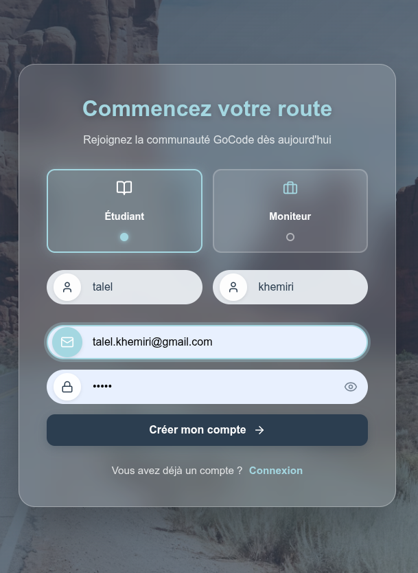
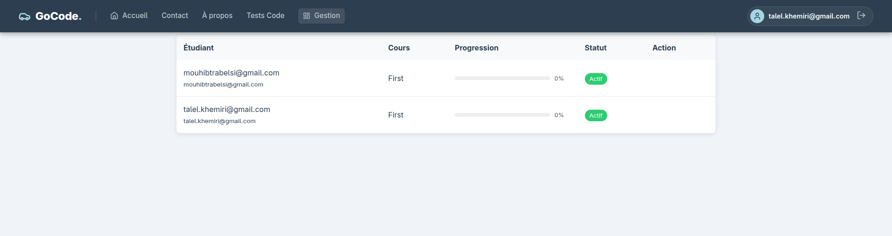

# GoCode Learning Platform 🎓


**GoCode** is a full-stack online learning platform that enables instructors to create and manage courses, while students can enroll, learn, and track their progress through a modern web interface.

Built with **Django REST Framework** on the backend and **React + Vite** on the frontend, with automation scripts to make setup fast and beginner-friendly.

---

## ✨ Features

| Feature | Description |
|---|---|
| 👩‍🏫 Instructor Dashboard | Create, edit, and manage courses |
| 🎓 Student Enrollment | Browse and enroll in available courses |
| 📊 Progress Tracking | Visual tracking of learning progress |
| 🔐 REST API | Secure endpoints via Django REST Framework |
| ⚡ Fast Frontend | Hot-reload dev experience with Vite |
| 🛠 Auto Setup | One-command setup scripts for backend & frontend |

---

## 🖼 Screenshots

<p align="center">
  
  &nbsp;
  
</p>

---

## 📑 Table of Contents

- [📂 Project Structure](#-project-structure)
- [🛠 Technology Stack](#-technology-stack)
- [⚙️ Prerequisites](#️-prerequisites)
- [🚀 Installation Guide](#-installation-guide)
- [▶️ Running the Application](#️-running-the-application)
- [🔌 API Overview](#-api-overview)
- [🐞 Troubleshooting](#-troubleshooting)
- [🤝 Contributing](#-contributing)
- [📄 License](#-license)

---

## 📂 Project Structure

```text
GoCode/
├── backend/                    # Django REST API
│   ├── DBcreate.py             # MySQL database creation script
│   ├── setup.py                # Backend automation script
│   ├── requirements.txt        # Python dependencies
│   ├── manage.py               # Django entry point
│   └── ...
├── frontend/                   # React + Vite client
│   ├── setup.py                # Frontend automation script
│   ├── package.json            # Node dependencies
│   └── ...
├── docs/                       # Documentation & screenshots
│   └── screenshots/
└── README.md
```

---

## 🛠 Technology Stack

<table>
  <tr>
    <th>Layer</th>
    <th>Technology</th>
    <th>Purpose</th>
  </tr>
  <tr>
    <td rowspan="4"><strong>Backend</strong></td>
    <td>Python 3.10+</td>
    <td>Core language</td>
  </tr>
  <tr>
    <td>Django</td>
    <td>Web framework</td>
  </tr>
  <tr>
    <td>Django REST Framework</td>
    <td>API layer</td>
  </tr>
  <tr>
    <td>MySQL</td>
    <td>Relational database</td>
  </tr>
  <tr>
    <td rowspan="3"><strong>Frontend</strong></td>
    <td>Node.js (LTS)</td>
    <td>Runtime environment</td>
  </tr>
  <tr>
    <td>React</td>
    <td>UI library</td>
  </tr>
  <tr>
    <td>Vite</td>
    <td>Build tool & dev server</td>
  </tr>
</table>

---

## ⚙️ Prerequisites

Make sure the following are installed before proceeding:

- ✅ **Python 3.10+** — [python.org](https://www.python.org/downloads/) · must be added to PATH
- ✅ **Node.js LTS** — [nodejs.org](https://nodejs.org/)
- ✅ **MySQL Server** — running locally · verify with `mysql -u root`

---

## 🚀 Installation Guide

> ⚠️ Run all commands from the **project root** unless stated otherwise.

### 1️⃣ Database Setup

```bash
cd backend
python -m venv venv
source ./venv/bin/activate        # Windows: venv\Scripts\activate
pip install -r requirements.txt
sudo ./venv/bin/python DBcreate.py
```

> This automatically creates the required MySQL database for GoCode.

---

### 2️⃣ Backend Setup

```bash
sudo ./venv/bin/python setup.py
```

When prompted, select **Option 1 – Fresh Start**.

The script will automatically:

- ✔ Install all Python dependencies  
- ✔ Run Django database migrations  
- ✔ Create an admin superuser  
- ✔ Start the Django development server  

**Backend available at:** `http://127.0.0.1:8000/`

---

### 3️⃣ Frontend Setup

Open a **new terminal**, then run:

```bash
cd frontend
python setup.py
```

When prompted, select **Option 1 – First Time Setup**.

**Frontend available at:** `http://localhost:5173/`

---

## ▶️ Running the Application

Both servers must be running simultaneously:

```
Backend  →  http://127.0.0.1:8000/   (Django)
Frontend →  http://localhost:5173/   (React + Vite)
```

Open your browser and go to **http://localhost:5173/** to use GoCode.

---

## 🔌 API Overview

**Base URL:** `http://127.0.0.1:8000/api/`

| Method | Endpoint | Description |
|--------|----------|-------------|
| `GET` | `/api/courses/` | List all courses |
| `POST` | `/api/courses/` | Create a new course |
| `GET` | `/api/students/` | List all students |
| `POST` | `/api/enroll/` | Enroll a student in a course |

> 📘 Full API documentation via **Swagger** or **Postman** will be added in a future update.

---

## 🐞 Troubleshooting

<details>
<summary><strong>Migration or database errors</strong></summary>

```bash
cd backend
source ./venv/bin/activate
python setup.py
# → Choose Option 1 – Fresh Start
```
</details>

<details>
<summary><strong>Frontend shows a network or connection error</strong></summary>

- Confirm the Django backend is running on port `8000`
- Check for port conflicts or firewall rules
- Verify the API base URL in the frontend config matches the backend
</details>

<details>
<summary><strong>MySQL connection refused</strong></summary>

```bash
sudo systemctl start mysql     # Start MySQL service
mysql -u root                  # Verify root access
```

Also check that the credentials in `DBcreate.py` match your local MySQL setup.
</details>

---

## 🤝 Contributing

Contributions are welcome and appreciated!

1. Fork the repository
2. Create a feature branch: `git checkout -b feature/your-feature-name`
3. Commit your changes: `git commit -m "Add: your feature"`
4. Push to your branch: `git push origin feature/your-feature-name`
5. Open a **Pull Request**

Please follow existing code conventions and include relevant comments.

---

## 📄 License

This project is currently for **educational purposes**.  
A formal open-source license (e.g., MIT) will be added in a future release.

---

<p align="center">Happy coding 🚀</p>
